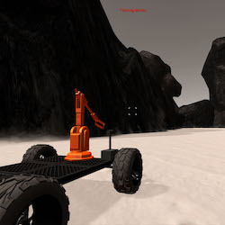

# Project-1-Search-and-Sample-Return
## Writeup by Christian Chavez
## Aug 2018

  

## 1. Training Mode
After have all the environment download and installed, I started recording data from the training mode and saving it in a IMG folder 
